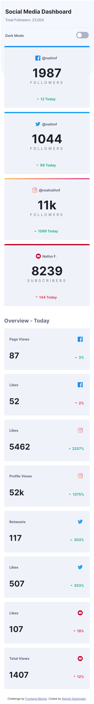
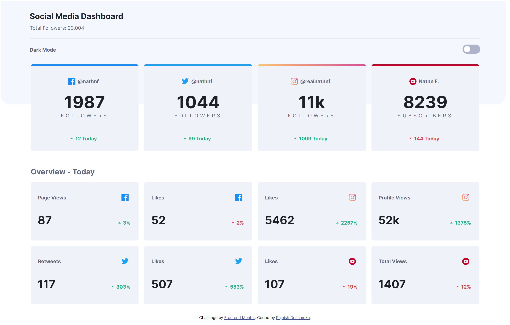

# Frontend Mentor - Social media dashboard with theme switcher solution

This is a solution to the [Social media dashboard with theme switcher challenge on Frontend Mentor](https://www.frontendmentor.io/challenges/social-media-dashboard-with-theme-switcher-6oY8ozp_H). Frontend Mentor challenges help you improve your coding skills by building realistic projects.

## Table of contents

- [Overview](#overview)
  - [The challenge](#the-challenge)
  - [Screenshot](#screenshot)
  - [Links](#links)
- [My process](#my-process)
  - [Built with](#built-with)
  - [What I learned](#what-i-learned)
  - [Useful resources](#useful-resources)
- [Author](#author)
- [Acknowledgments](#acknowledgments)

## Overview

### The challenge

Users should be able to:

- View the optimal layout for the site depending on their device's screen size
- See hover states for all interactive elements on the page
- Toggle color theme to their preference

### Screenshot




### Links

- Solution URL: [frontend mentor](https://www.frontendmentor.io/solutions/mobile-first-grid-flexbox-and-a-little-javascript-CjI6qepFB)
- Live Site URL: [github page](https://drajnish.github.io/social-media-dashboard/)

## My process

### Built with

- Semantic HTML5 markup
- CSS custom properties
- Flexbox
- CSS Grid
- Mobile-first workflow

### What I learned

About grid, auto-fit and minmax.
How to toggle theme with css and javascript.

```css
.top-container,
.overview-cards {
  display: grid;
  gap: 1rem;
  grid-template-columns: repeat(auto-fit, minmax(250px, 1fr));
}
```

```js
checkbox.addEventListener("change", () => {
  const html = document.querySelector("html");

  html.classList.toggle("dark");
});
```

### Useful resources

- [css grid](https://www.youtube.com/watch?v=t6CBKf8K_Ac&t=1111s) - This helped me for responsive grid. I'd recommend it to anyone still learning this concept.
- [Light/Dark Theme Toggle](https://www.youtube.com/watch?v=xodD0nw2veQ&t=9s) - This is an amazing video to learn about theme toggle.

## Author

- Frontend Mentor - [@drajnish](https://www.frontendmentor.io/profile/drajnish)
- Twitter - [@DeshmukhRajnish](https://www.twitter.com/DeshmukhRajnish)
